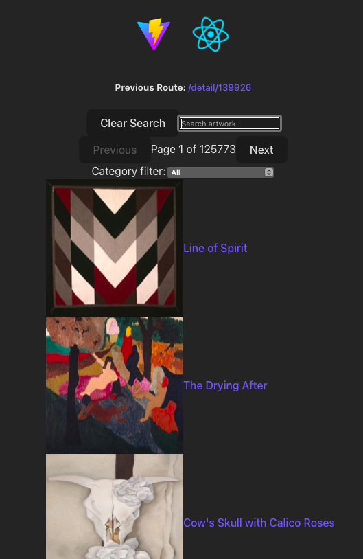
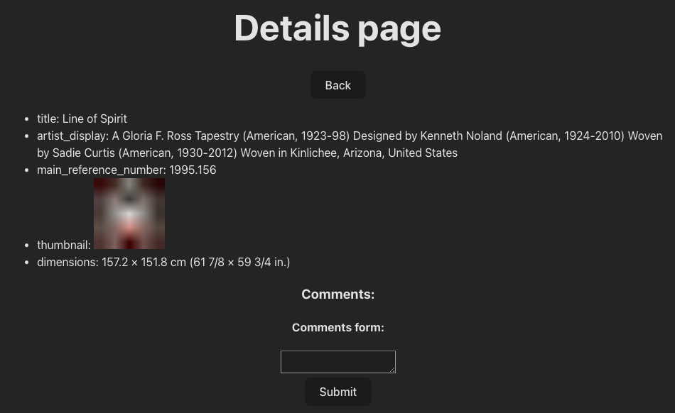

# Built using React + TypeScript + Vite
## The Task
- Create a single page react application using responsive design (the application should render properly on a desktop and mobile device)
- The Application should use the [following](https://api.artic.edu/docs/#quick-start) API to retrieve a set of artwork
- The artworks should be listed 10/page with pagination
- Each item title and thumbnail should be clickable to bring up the artwork detail page
- Display details about the item on a seperate page and have a back button to return to the list page and display the page the user was on
- List the following items on the detail page:
  title, artist_display, date_display, main_reference_number, thumbnail, dimensions
- Implement the ability to search the artwork by title and the ability to filter the results by category
- Document your design decisions
- You can create components from scratch or you can use a component library but the more code you write yourself, the better
- Create a comments form to demonstrate data validation, the form does not need to make an API call to presist the data
- Using TypeScript is a bonus but not required
### Warning
Warning, some artwork is NSFW.
### Quick Start
```
npm install
npm run dev
```
### Screenshots


